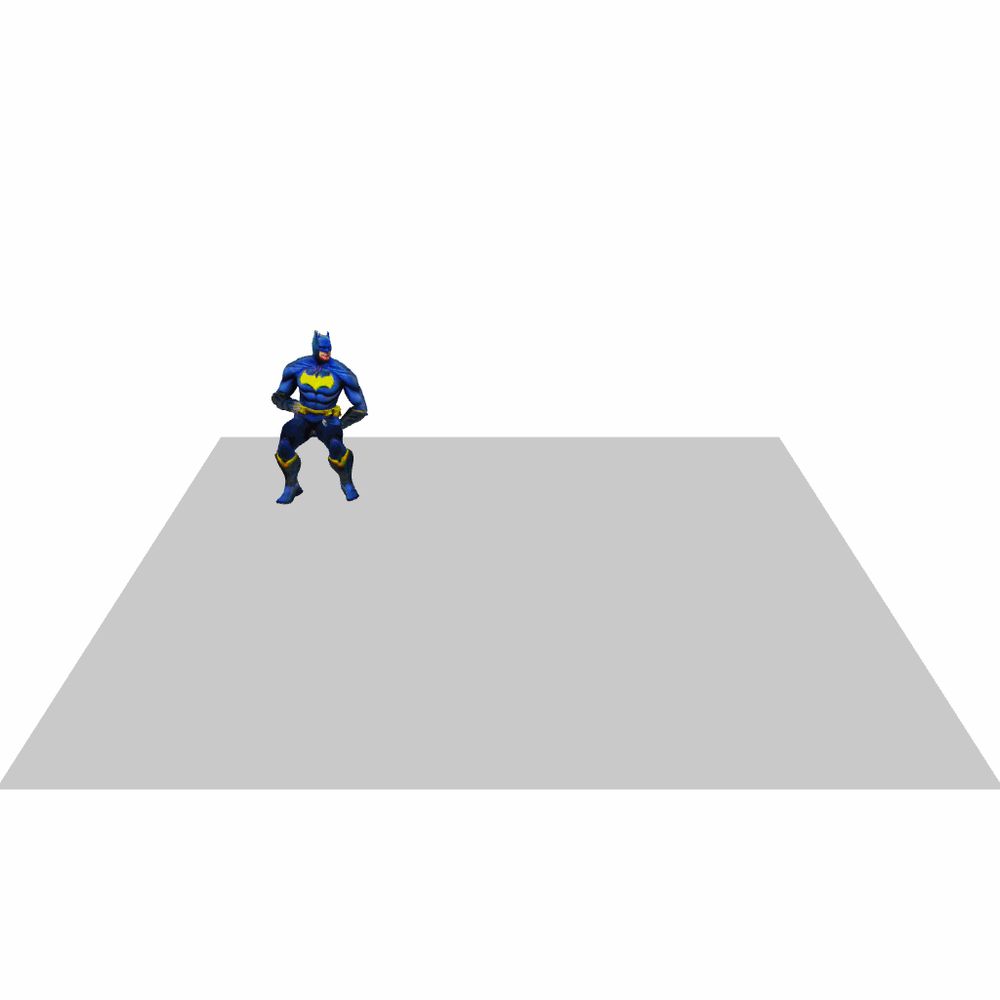

<div align="center">

<h1> SemanticBoost: Elevating Motion Generation with Augmented Textual Cues </h1>

  <a href=''></a> &nbsp; <a href='https://blackgold3.github.io/SemanticBoost.github.io'></a> &nbsp; [](https://huggingface.co/spaces/Kleinhe/SemanticBoost)  &nbsp; [](https://discord.gg/rrayYqZ4tf)


<div>
    <b><a href="https://github.com/blackgold3" target="_blank">Xin He</a></b> &emsp;
    <b><a href="https://scholar.google.com/citations?user=o31BPFsAAAAJ&hl=en" target="_blank">Shaoli Huang<sup>*</sup></a> &emsp;
    <b><a href="https://xiaohangzhan.github.io/" target="_blank">Xiaohang Zhan</a><br></b>  <br>
    <b><a href="https://scholar.google.com/citations?user=pRA19-8AAAAJ&hl=en" target="_blank">Chao Weng</a></b> &emsp;
    <b><a href="https://scholar.google.com/citations?user=4oXBp9UAAAAJ&hl=zh-TW" target="_blank">Ying Shan</a></b> &emsp;
</div>
<br>

<a href="https://ai.tencent.com/ailab/zh/index"></a>


</div>

## 💡 Highlights


SemanticBoost framework consists of optimized diffusion model **CAMD** and **Semantic Enhancement Module** which describe specific body parts explicitly. With two modules, SemanticBoost can:

- Synthesize more smooth and stable motion sequences.
- Understand longer and more complex sentences.
- Control specific body parts precisely

 

## ⚙ Applications


In this repo, we achieves the functions:

- Export 3D joints
- Export SMPL representation
- Render with TADA 3D roles

<table>
  <tr>
    <td></td>
    <td></td>
    <td></td>
  </tr>
</table>

## 📰 Introduction of SemanticBoost

<details>
  <summary><b>Optimized Diffusion Model</b></summary>
  
</details>

<details>
  <summary><b>Semantic Enhancement Module</b></summary>
  
</details>

<details>
  <summary><b>Comparison with SOTA</b></summary>
  
</details>

## 📢 News

[2023/10/20] **Release pretrained weights and inference process 🔥**

[2023/10/27] **Release new pretrained weights and tensorRT speedup**

## ⚡️ Quick Start

<details>
  <summary><b>Environment and Weights</b></summary>

### 1. Dependencies

```sh
python install -r requirements.txt
```

### 2. Linux Package - Debian (EGL package for render)
```sh
sudo apt-get install freeglut3-dev
```

### 3. Pretrained Weights
```sh
bash scripts/prepare.sh
```

### 4. (Optional) TADA Support

- Download Choice 1

  - Download charactors in 
  > https://drive.google.com/file/d/1rbkIpRmvPaVD9AJeCxWqBBYHkRIwrNmC/view

  - Download Init Pose in

  > https://tada.is.tue.mpg.de/download.php

  - Save two zip files in the root dir and then run command

  ```sh
  bash scripts/tada_process.sh
  ```

- Download Choice 2

  ```sh
  bash scripts/tada_goole.sh
  ```

### 5. (Optional) TensorRT Inference

- Download TensorRT SDK, we test with TensorRT-8.6.0 and pytorch 2.0.1
  > https://developer.nvidia.com/nvidia-tensorrt-8x-download

- Set environment

  ```sh
  export LD_LIBRARY_PATH=/data/TensorRT-8.6.0.12/lib:$LD_LIBRARY_PATH
  export PATH=/data/TensorRT-8.6.0.12/bin:$PATH
  ```

- Install python api

  ```sh
  pip install /data/TensorRT-8.6.0.12/python/tensorrt-8.6.0-cp39-none-linux_x86_64.whl
  ```

- Export TensorRT engine

  ```sh
  bash scripts/quanti.sh
  ```

</details>

## 👀 Demo

<details>

<summary><b>Webui or HuggingFace</b></summary>

Run the following script to launch webui, then visit [0.0.0.0:7860](http://0.0.0.0:7860)

```sh
python app.py
```

</details>

<details>

<summary><b>Inference and Visualization</b></summary>

### General Visualization

```sh

#### speedup = 1 infer with TensorRT speedup = 0 load torch model

python inference.py --prompt "120, A person walks forward and sits down on the chair." --mode ncamd --size 1024 --render_mode pyrender_slow --speedup 1
```

### TADA Visualization

```sh

######## More tada_role please refer to TADA-100

python inference.py --prompt "120, A person walks forward and sits down on the chair." --mode ncamd --size 1024 --render_mode pyrender_slow --tada_role "Iron Man" --speedup 1
```

### Prompt Engineering


1. **Normal sentences** -> (Length,) Sentence

    - Example: 120, A person waks backwards and sits down on the chair.

    - PS: If do not give length, the default setting is 196 frames.

2. **Detail control with semantic enhancement** -> (Length,) Sentence. During the process, (the person moves to [position],) (the person looks [head orientation],) (his left forearm moves to [left forearm position]).

    - Example: 120, A person walks. During the process, the person moves to the south, the person looks forward downward, then leftward backward, his left forearm moves to body's beside, then left front, left back repeatly.

3. **Long motion synthesis with DoubleTake strategy** -> (Length1, ) Sentence1 | (Length2, ) Sentence2 | ...

    - Example: 100, A person walks forward. | 120, A person dances in place. | 100, A person walks backwards.

    - PS: It will synthesize with DoubleTake when "|" is in the sentences.


</details>

## 📖 Citation

If you find our code or paper helps, please consider citing:

```bibtex

placeholder

```

## Acknowledgments

Thanks to [MDM](https://github.com/ChenFengYe/motion-latent-diffusion), [T2M-GPT](https://github.com/Mael-zys/T2M-GPT), [MLD](https://github.com/ChenFengYe/motion-latent-diffusion),  [HumanML3D](https://github.com/EricGuo5513/HumanML3D), [joints2smpl](https://github.com/wangsen1312/joints2smpl) and [TADA](https://github.com/TingtingLiao/TADA), our code is partially borrowing from them.
