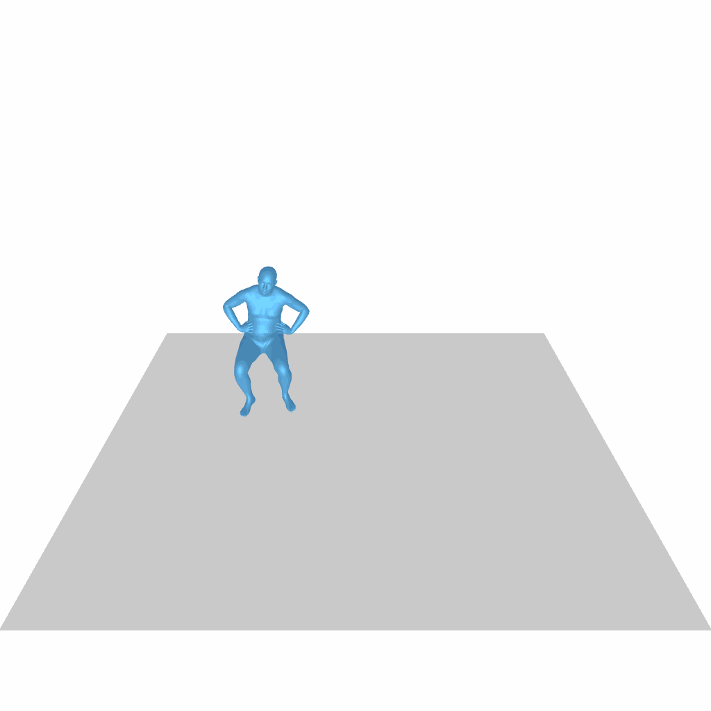
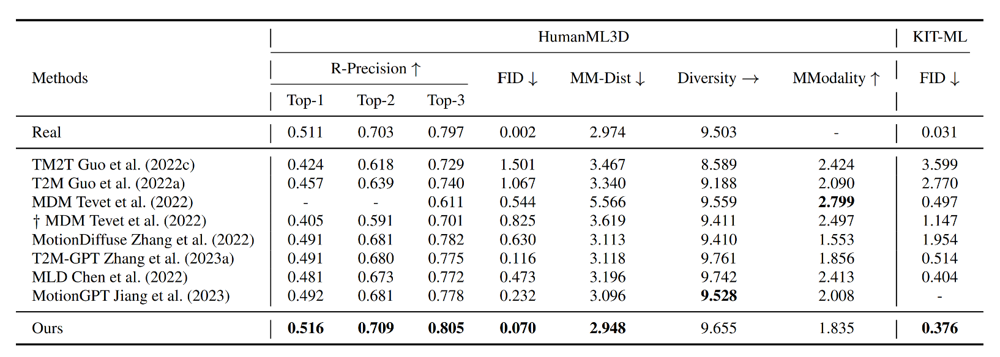

<div align="center">

<h1> SemanticBoost: Elevating Motion Generation with Augmented Textual Cues </h1>

  <a href='https://arxiv.org/abs/2211.12194'></a> &nbsp; <a href='https://sadtalker.github.io'></a> &nbsp; [](https://huggingface.co/spaces/vinthony/SadTalker)  &nbsp; [](https://discord.gg/rrayYqZ4tf)


<div>
    Xin He &emsp;
    Shaoli Huang &emsp;
    Xiaohang Zhan  <br>
    Chao Weng &emsp;
    Ying Shan &emsp;
</div>
<br>

<table border=0>
<tr>
<td></td>
<td><span style="font-size:20px"><b>Tencent AI Lab</b></span></td>
</tr>
</table>

</div>

## 💡 Highlights

SemanticBoost framework consists of optimized diffusion model **CAMD** and **Semantic Enhancement Module** which describe specific body parts explicitly. With two modules, SemanticBoost can:

- Synthesize more smooth and stable motion sequences.
- Understand longer and more complex sentences.
- Control specific body parts precisely


<table>
  <tr>
    <td></td>
    <td></td>
    <td></td>
    <td></td>
  </tr>
  <tr align="center">
    <td><span style="font-size:13px"> A person walks. During the process, the person moves to the north, his leftforarm moves to body's left front, left back repeatly. </span></td>
    <td><span style="font-size:13px"> A person walks backwards and sits down on the chair. During the process, the person moves to the south, the person looks leftward backward. </span></td>
    <td><span style="font-size:13px"> A person walks forward and does a handstand. During the process, the person moves to the west. </span></td>
    <td><span style="font-size:13px"> A person walks backwards. During the process, the person moves to east, the person looks rightward backward. </p></td>
  </tr>
</table>

## ⚙ Applications


In this repo, we achieves the functions:

- Export 3D joints
- Export SMPL representation
- Render with TADA 3D roles

<table>
  <tr>
    <td></td>
    <td></td>
    <td></td>
  </tr>
</table>

## 📰 Introduction of SemanticBoost

<details>
  <summary><b>Semantic Enhancement Module</b></summary>
  
</details>

<details>
  <summary><b>Optimized Diffusion Model</b></summary>
  
</details>

<details>
  <summary><b>Comparison with SOTA</b></summary>
  
</details>

## 📢 News

- [2023/10/20] **Release pretrained weights and inference process 🔥**

## ⚡️ Quick Start

<details>
  <summary><b>Environment and Weights</b></summary>

### 1. Dependencies

```sh
python install -r requirements.txt
```

### 2. Linux Package - Centos
```sh
yum update
yum install mesa*
```

### 3. Linux Package - Debian
```sh
sudo apt-get install freeglut3-dev
```

### 4. Pretrained Weights
```sh
bash scripts/prepare.sh
```

### 5. (Optional) TADA Support

- Download charactors in 
> https://drive.google.com/file/d/1rbkIpRmvPaVD9AJeCxWqBBYHkRIwrNmC/view

- Download Init Pose in

> https://tada.is.tue.mpg.de/download.php

- Save two zip files in the root dir and then run command

```
bash scripts/tada_process.sh
```

</details>

## 👀 Demo

<details>

<summary><b>Webui or HuggingFace</b></summary>

Run the following script to launch webui, then visit [0.0.0.0:7860](http://0.0.0.0:7860)

```sh
python app.py
```

</details>

<details>

<summary><b>Inference and Visualization</b></summary>

### General Visualization

```sh
python inference.py --prompt "120, A person walks forward and sits down on the chair." --mode cadm --size 1024 --render_mode pyrender_slow
```

### TADA Visualization

```sh
python inference.py --prompt "120, A person walks forward and sits down on the chair." --mode cadm --size 1024 --render_mode pyrender_slow --tada_role "Iron Man"
```

</details>

## 📖 Citation

If you find our code or paper helps, please consider citing:

```bibtex

placeholder

```

## Acknowledgments

Thanks to [MDM](https://github.com/ChenFengYe/motion-latent-diffusion), [T2M-GPT](https://github.com/Mael-zys/T2M-GPT), [MLD](https://github.com/ChenFengYe/motion-latent-diffusion),  [HumanML3D](https://github.com/EricGuo5513/HumanML3D), [joints2smpl](https://github.com/wangsen1312/joints2smpl) and [TADA](https://github.com/TingtingLiao/TADA), our code is partially borrowing from them.
